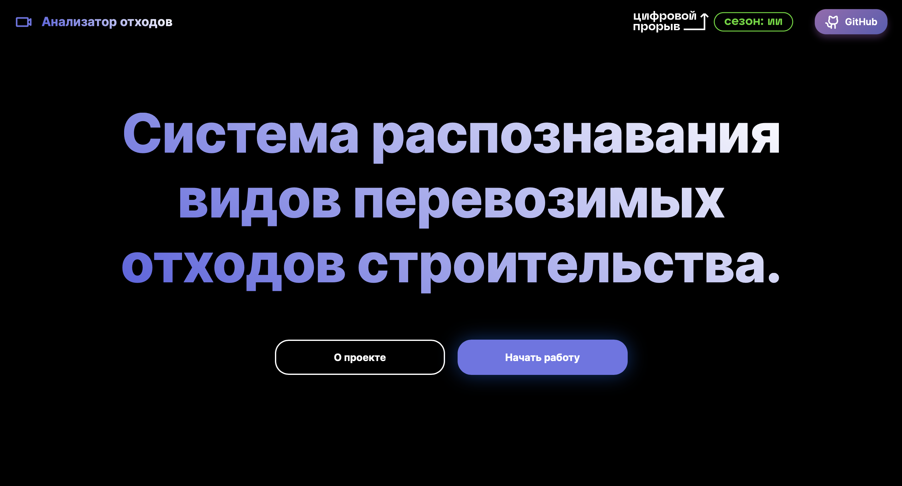

# Анализатор отходов

## Описание решения

Кейс: Определение вида отходов

Партнер: Департамент строительства города Москвы

Веб-сайт содержит информацию о команде и проекте, описание преимуществ и ссылку на репозиторий решения. Также присутствует возможность анализа видеофайлов онлайн и последущего экспорта результатов в csv-файл.

#### Хакатон "Цифровой прорыв". Москва, 23.11.2023 – 26.11.2023
